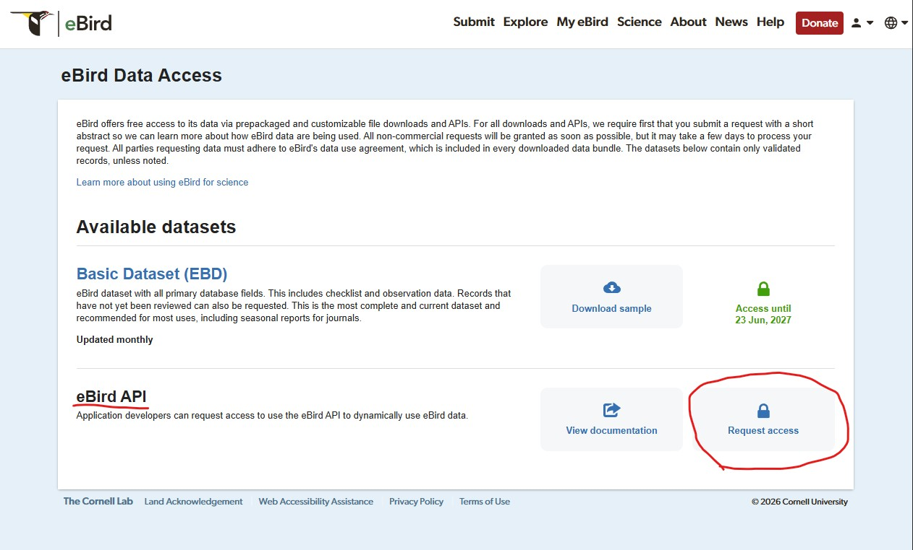

# BirdSights

A beginner-friendly bird discovery web application that helps birdwatchers quickly locate recent eBird reports of a selected bird species near a chosen location — and helps beginners discover birds even when they don't know any bird names.

> **Penn State IST 440W Capstone Project**

BirdSights is **not a replacement for eBird**. It is a lightweight discovery layer on top of eBird data.

**Live app:** [https://birdsights.vercel.app](https://birdsights.vercel.app)
**Backend API:** [https://birdsights-api.onrender.com](https://birdsights-api.onrender.com)
**GitHub:** [https://github.com/Claudlines/BirdSights](https://github.com/Claudlines/BirdSights)

---

## Quick Start (Beginner Guide)

New here? This is the fastest way to run BirdSights on your own computer. First install **Node.js 18 or newer** from [nodejs.org](https://nodejs.org) (this also installs `npm`). You can confirm it worked by running `node -v` in a terminal.

### Step 1 — Get the code, install everything, and create your config files

```bash
git clone https://github.com/Claudlines/BirdSights.git
cd BirdSights
npm install
npm run install:all
npm run setup
```

- `npm install` sets up the one-command runner (`concurrently`) in the project root.
- `npm run install:all` installs the backend **and** frontend dependencies for you.
- `npm run setup` creates your local `server/.env` and `client/.env` from the safe example files. It **never overwrites** a `.env` file you already have, so it's safe to re-run.

### Step 2 — Add your API keys to `server/.env`

`npm run setup` already created the two `.env` files from safe templates (`server/.env` and `client/.env`). These files hold your settings and keys, stay on your computer, and are ignored by Git.

You still need to paste in **your own eBird API key**. Open `server/.env` and replace the `your_..._here` placeholders. It looks like this:

```
PORT=5000
CLIENT_ORIGIN=http://localhost:5173
NOMINATIM_USER_AGENT=BirdSights/1.0 student-capstone-project
EBIRD_API_KEY=your_ebird_api_key_here
OPENAI_API_KEY=your_openai_api_key_here
OPENAI_MODEL=gpt-4o-mini
ASK_RATE_LIMIT_MAX=20
ASK_RATE_LIMIT_WINDOW_MINUTES=15
DATA_RATE_LIMIT_MAX=100
DATA_RATE_LIMIT_WINDOW_MINUTES=15
```

- The four `RATE_LIMIT` lines are **optional**; if you leave them out, the defaults shown above are used automatically.
- `client/.env` is already set to `VITE_API_BASE_URL=http://localhost:5000` — no change needed for local development.
- **Never commit your `.env` files.** They hold private keys and are already gitignored.

#### Getting your eBird API key (required)

BirdSights needs a free **eBird API key / access token** to look up bird reports. To get one:

1. **Create or log into an eBird account** at [ebird.org](https://ebird.org).
2. Go to the **eBird Data Access** page: [https://ebird.org/ebird/downloadMyData](https://ebird.org/ebird/downloadMyData)
3. On that page, find the **"eBird API"** section. The screenshot below shows this page — the **"eBird API"** section with a **"Request access"** button (circled in red):

   

4. Click **"Request access."**
5. Wait for access to be granted. Once it is, eBird provides your **API key / access token**.
6. Copy that key/token into `server/.env` as the `EBIRD_API_KEY` value:

   ```
   EBIRD_API_KEY=their_ebird_api_key_here
   ```

   (Replace `their_ebird_api_key_here` with your actual eBird key/token.)

> **Don't confuse the two kinds of eBird access.** The **eBird Basic Dataset (EBD)** is a large historical download and is **not** needed to run BirdSights. What you need here is the **eBird API key / access token** from the **"eBird API"** section — *not* the EBD download.

#### OpenAI API key (optional — only for Ask BirdSights)

`OPENAI_API_KEY` is **optional**. It is only needed for the **Ask BirdSights** assistant; standard search and Explore Birds Near You work fully without it.

1. Create an API key from the **OpenAI Platform** dashboard: [platform.openai.com](https://platform.openai.com).
2. Paste it into `server/.env` as the `OPENAI_API_KEY` value.
3. **Never** show it on screen, commit it to GitHub, or place it in any `client/` (frontend) file — API keys belong only in the backend `server/.env`.
4. If `OPENAI_API_KEY` is missing, the rest of BirdSights still works normally; only **Ask BirdSights** shows a friendly "not configured" message.

> **Prefer to do it by hand?** You can copy the templates yourself instead of running `npm run setup`:
> `cp server/.env.example server/.env` and `cp client/.env.example client/.env`.
> On Windows **Command Prompt** use `copy` instead of `cp`; **PowerShell** and **Git Bash** accept `cp`.

> **Recorded demo note:** For a recorded walkthrough, **do not open `server/.env` on screen** — it contains private API keys. It is fine to explain that the file has **already been configured** on the demo computer. A TA or new developer following this README will need to use **their own** eBird API key and optional OpenAI API key. (`npm run setup` leaves any existing `.env` untouched, so a pre-configured demo file stays exactly as it is.)

### Step 3 — Run the app (one command)

From the project root (the `BirdSights` folder):

```bash
npm run dev
```

Then open **[http://localhost:5173](http://localhost:5173)** in your browser.

This single command starts both parts at once:
- **Backend (API):** http://localhost:5000
- **Frontend (website):** http://localhost:5173

To stop the app, click the terminal and press **Ctrl + C**.

### Fallback — the two-terminal method

If you prefer to run each part in its own window (or the one-command method gives you trouble), open **two terminals**.

**Terminal 1 — backend:**
```bash
cd server
npm start
```

**Terminal 2 — frontend:**
```bash
cd client
npm run dev
```

Then open http://localhost:5173. This is the original method and still works exactly the same.

---

## How to Use BirdSights

Once the app is open at http://localhost:5173, here's what you can do. Everything BirdSights shows is based on **recent eBird reports** and **returned report locations** — it tells you where a bird was **reported nearby** recently. It does **not** guarantee the bird is currently present.

- **Search for a specific bird** — In the search card, start typing a bird name (e.g., *Blue Jay*) and pick it from the suggestions. Enter a location (city, ZIP code, park, or address), choose a radius (5–50 km) and a timeframe (7, 14, or 30 days), then click **Find Recent Reports**. You'll see recent returned report locations on the map and in a list.

- **Explore Birds Near You** — Don't know any bird names? Enter a location (or use current location) and click **Show birds near me**. BirdSights lists up to 10 birds recently reported nearby, grouped into beginner-friendly categories (frequently, occasionally, notable, or few recent reports). Click **Search this bird** on any card to see it on the map.

- **Ask BirdSights** — Type a plain-English question (e.g., *"Have there been any Barn Owls in ZIP code 10468 recently?"*). The assistant interprets your question and answers using recent eBird data. It never invents sightings.

- **Save a search** — On the results page, click **Save Search** to keep it. Saved searches appear in the **Saved Searches** panel on the landing page, where you can rerun or delete them. They are stored **locally in your browser only**.

- **Read the map pins** — Each pin marks a **returned report location**. Click a pin (or a result card) to see details in the Selected Report panel. The blue pin is the location you have selected.

- **Understand freshness colors** — Pin color shows **how old the returned report is**, not how likely the bird is to be present:
  - 🟢 **Green** — Fresh report (0–7 days old)
  - 🟡 **Amber** — Recent report (8–14 days old)
  - 🔴 **Red** — Older report (15+ days old)
  - 🔵 **Blue** — Your selected location

- **Use current location** — Click **📍 Use My Current Location** to search around you. Your browser will ask permission. If you deny it (or it is unavailable), you can still type a location manually.

- **Understand "Pending" image placeholders** — BirdSights includes curated photos for a starter set of birds. Birds without a curated image show an **"Image pending" / "Pending"** placeholder instead. This is normal and does not affect the report data.

---

## Test Examples to Try

Good first searches and questions to confirm everything works. Results come from live eBird data and will change over time.

**Standard search:**
- **Blue Jay** near `19153`, radius **25 km**, timeframe **30 days**
- **Northern Cardinal** near `19153`
- **American Robin** near **New York City**, radius **50 km**, timeframe **30 days** (a dense area — you may see the large-result notice)

**Ask BirdSights:**
- *"Have there been any Barn Owls in ZIP code 10468 recently?"*
- *"I don't know any birds. What birds are reported near me?"*

**Broad-location safety test:**
- Enter **Pennsylvania** as a location. BirdSights should **ask you for a more specific place** (a city, ZIP code, park, or address) instead of running a misleading single-point search. **New Jersey**, **USA**, and **Canada** behave the same way.

These examples show recent returned eBird reports only; they do not guarantee a bird is present, and they do not measure true abundance or true rarity.

---

## Troubleshooting (Beginner)

- **`npm` command not found** — Node.js isn't installed, or the terminal needs restarting. Install Node.js 18+ from [nodejs.org](https://nodejs.org), close and reopen your terminal, then run `node -v` to confirm.

- **Port 5000 already in use** — Another program (often a leftover BirdSights backend) is using it. On **Windows**: `netstat -ano | findstr :5000` to find the process ID, then `taskkill /PID <that-id> /F`. On **Mac/Linux**: `lsof -i :5000` then `kill <pid>`. Then run `npm run dev` again.

- **Frontend can't connect to the backend** — Make sure the backend is running by visiting http://localhost:5000/api/health — you should see `{"status":"ok",...}`. Check that `client/.env` contains `VITE_API_BASE_URL=http://localhost:5000`. Restart `npm run dev` after changing any `.env` file.

- **"The eBird API key is not configured"** — You haven't added a valid `EBIRD_API_KEY` to `server/.env`. Get a free key/token via the eBird **Data Access** page ([ebird.org/ebird/downloadMyData](https://ebird.org/ebird/downloadMyData) → **"eBird API"** section → **"Request access"**), paste it into `server/.env`, and restart the backend.

- **Ask BirdSights says it's "not configured"** — The `OPENAI_API_KEY` is missing in `server/.env`. Ask BirdSights is optional — add a key to enable it, or keep using standard search and Explore, which don't need it.

- **Current location permission denied** — Your browser blocked location access. BirdSights shows a friendly message and you can type a location manually instead. To re-enable, allow location access for the site in your browser's address-bar site settings.

- **Saved searches don't appear** — Saved searches live in your browser's local storage. They won't appear if you switch browsers, use a private/incognito window, or the browser blocks storage. Save again in your normal browser window.

- **eBird or OpenAI seems slow or returns an error** — These are public external services and can be briefly unavailable or rate-limited. BirdSights shows a friendly message; wait a moment and try again.

- **Stopping the app** — Click the terminal running `npm run dev` and press **Ctrl + C**. On Windows, if port 5000 stays busy afterward, free it using the "Port 5000 already in use" steps above before restarting.

---

## Security Notes

- **Never commit your `.env` files.** They hold your private keys. Both `server/.env` and `client/.env` are already listed in `.gitignore`, so Git ignores them by default — keep it that way.
- **Never put your OpenAI or eBird key in the frontend.** API keys belong only in `server/.env` (backend). Anything placed in `client/` is shipped to the browser and would expose the key.
- **Local vs. production keys:** keep keys in `server/.env` for local development, and set them as **Render environment variables** for the deployed backend. Do **not** add them to Vercel (the frontend host).
- **Only `.env.example` files are tracked** in Git, and they contain placeholder names only (like `your_ebird_api_key_here`) — never real keys.
- **Rate limiting is built in:** Ask BirdSights (`/api/ask`) and the data endpoints (`/api/search`, `/api/explore`) are rate-limited per IP, so the app degrades gracefully with a friendly message and the paid OpenAI endpoint and shared eBird quota are protected.

---

## Project Overview

BirdSights answers questions like:
**"Has this bird been reported near me recently, and where?"** — and, for beginners — **"I don't know any birds. What birds are reported near me?"**

Users can:

1. **Standard search** — select a bird species, specify a location (manually or via GPS), choose a search radius and timeframe, and view recent eBird sighting locations on an interactive map;
2. **Ask BirdSights** — type a plain-English question and get a safely worded answer built from the same eBird data; or
3. **Explore Birds Near You** — enter a location (or use current location) and get a beginner-friendly list of birds recently reported nearby.

---

## Features

### Core search

- Bird species search with full eBird taxonomy autocomplete (when the backend API key is configured)
- Local fallback species list when taxonomy lookup is unavailable
- Bird thumbnails in autocomplete for curated species; "Pending" placeholders for birds without local images
- Selected bird reference image card on the results page (also shown when no sightings are found)
- Manual location search (city, ZIP code, park, address, landmark)
- GPS / current location detection
- Radius filtering: 5, 10, 25, 50 km
- Timeframe filtering: 7, 14, 30 days
- eBird API integration (recent nearby observations)
- Backend geocoding via OpenStreetMap Nominatim

### Map and results

- Interactive map (React Leaflet + OpenStreetMap tiles) with clickable pins
- **Map pins colored by report freshness** (returned report age — see below)
- Search radius boundary displayed on the map
- Map key explaining pin colors, selected location, and search radius boundary
- Recent eBird Sighting Locations list with checklist links and freshness badges
- SummaryPanel with nearby sighting locations and individuals in returned eBird reports
- Bird Activity Summary (recent activity label, most recent report, closest report, radius, timeframe)
- Newest/oldest sorting and pagination
- Saved searches stored locally in the browser using localStorage, with one-click rerun
- Search inputs preserved when returning from the results page
- Responsive layout (desktop + mobile), dark mode, BirdSights logo and favicon
- Balanced desktop landing layout — Explore Birds Near You (left), standard search + Ask BirdSights (center), Saved Searches (right) — stacking cleanly on mobile

### Explore Birds Near You (July 12 enhancement)

A beginner-focused discovery feature for users who do not know bird names.

- Enter a city, ZIP code, park, town, or address — or use current location — plus a radius (default 25 km) and timeframe (default last 30 days).
- BirdSights returns up to 10 birds recently reported nearby, organized into beginner-friendly categories:
  - **Frequently reported nearby** — 10+ returned report locations
  - **Occasionally reported nearby** — 3–9 returned report locations
  - **Notable or uncommon nearby** — reports flagged as notable by eBird
  - **Few recent reports** — 1–2 returned report locations
- Categories are based on **recent returned eBird data** — they do not measure true abundance or true rarity, and they do not guarantee any bird is currently present.
- Each suggested bird shows a local image when available, or a "Pending" placeholder.
- **"Search this bird"** opens the normal BirdSights results page (map, freshness pins, Bird Activity Summary) using the same location, radius, and timeframe.
- Bird selection is randomized within categories so repeat visits feel fresh.
- Powered by a new `GET /api/explore` endpoint with **short-term in-memory caching (about 10 minutes)** to reduce repeated eBird API calls. No database is used, and **EBD is not used** for this feature.

### Ask BirdSights (AI-assisted discovery agent)

A landing-page natural-language assistant. The backend uses the **OpenAI API only to interpret and route the question** — OpenAI never creates bird data. Each question is classified into one of four actions:

| Action | When it applies | Example |
|--------|-----------------|---------|
| `species_search` | A specific bird near a place | *"Have there been any Barn Owls in ZIP code 10468 recently?"* |
| `explore_location` | The user doesn't know bird names and wants suggestions | *"I don't know any birds. What birds are reported near me?"* |
| `explain_feature` | The user asks what an app feature means | *"What do the colored pins mean?"* |
| `clarification` | Incomplete, unrelated, or broad/ambiguous input | *"What birds are in New Jersey?"* |

How the answers work:

- **Species answers** show a structured card: nearby sighting locations, most recent returned report, closest returned report, top returned locations, a limitation note, "View map results", and quick actions ("Try 50 km", "Try last 7 days") that rerun without another OpenAI call.
- **Explore answers** show suggested birds with category labels, reasons, local images or "Pending" placeholders, and a per-bird "Search this bird" button — reusing the same backend logic as `/api/explore`.
- **Explanation answers** are deterministic, safely worded texts (freshness pin colors, category labels, and report limitations such as whether a bird is guaranteed to be present) — no eBird call is needed.
- **Current-location questions** ("near me", "my location") prompt a "Use my current location" button that uses browser geolocation.
- `POST /api/ask` is **rate-limited** (default 20 requests per 15 minutes per IP) to protect the paid OpenAI endpoint; exceeding it returns a friendly HTTP 429 message.
- **`OPENAI_API_KEY` is backend-only — never exposed to the frontend and never committed.** If it is not configured, Ask BirdSights returns a friendly "not configured" message and every other feature keeps working.
- The card includes an AI/data disclaimer: Ask BirdSights uses AI to interpret the question, then searches recent eBird data — verify important details with the linked eBird checklists.

### Broad-location clarification

Both the standard search form and Ask BirdSights detect broad or ambiguous locations — such as **New York, New Jersey, Pennsylvania, USA, Canada** — and ask the user for a more specific place instead of running a misleading single-point radius search. Detection uses a known state/province/country list plus Nominatim's own area classification.

Specific places still work normally: **New York City, Philadelphia, 10468, 19153, Cape May NJ, Central Park**, parks, addresses, and GPS/current location.

### Map pin freshness colors

Pins are colored by the age of the returned report:

| Pin color | Category | Returned report age |
|-----------|----------------|---------------------|
| Green     | Fresh report   | 0–7 days old        |
| Amber     | Recent report  | 8–14 days old       |
| Red       | Older report   | 15+ days old        |
| Blue      | Selected location | —                |

**These colors show how old the returned report is only. They do not indicate the likelihood that the bird is still present.** The map legend states this, and result cards show matching freshness badges. The selected marker turns blue, and the search radius boundary is drawn around the search center.

### Bird Activity Summary

The results page interprets recent returned eBird activity for the searched bird using safe labels based on the number of returned results: **No recent nearby reports** (0), **Rarely reported nearby** (1–2), **Occasionally reported nearby** (3–9), and **Frequently reported nearby** (10+). It also shows the most recent returned report, the closest returned report, the search radius, and the timeframe. These labels reflect recent returned eBird reports — not true abundance and not guaranteed presence.

---

## Technology Stack

| Layer    | Technology                                      |
|----------|-------------------------------------------------|
| Frontend | React 18, Vite 8, React Leaflet, CSS            |
| Backend  | Node.js ≥ 18, Express, node-fetch, express-rate-limit |
| AI       | OpenAI API (backend-only question interpretation) |
| Map      | Leaflet + OpenStreetMap tiles                   |
| Data     | eBird API v2, Nominatim Geocoding API           |
| Deploy   | Frontend → Vercel · Backend → Render            |

**Node.js 18 or newer is required.**

---

## Folder Structure

```
BirdSightsProject/
  .gitignore
  README.md
  client/
    package.json
    index.html
    vite.config.js
    .env.example
    src/
      main.jsx
      App.jsx
      api/
        searchApi.js
        askApi.js
        exploreApi.js
      components/
        AskBirdSights.jsx
        ExploreBirdsNearYou.jsx
        BirdAutocomplete.jsx
        BirdActivitySummary.jsx
        BirdImageCard.jsx
        SearchForm.jsx
        ResultsPage.jsx
        MapView.jsx
        SelectedReportPanel.jsx
        SavedSearchesPanel.jsx
        SummaryPanel.jsx
        ReportList.jsx
        LegendPanel.jsx
        ErrorMessage.jsx
        LoadingIndicator.jsx
      data/
        supportedBirds.js
      utils/
        activitySummary.js
        birdImages.js
        groupReports.js
        reportFreshness.js
        savedSearches.js
        sortReports.js
      styles/
        main.css
  server/
    package.json
    server.js
    .env.example
    routes/
      searchRoutes.js
      speciesRoutes.js
      askRoutes.js
      exploreRoutes.js
    services/
      ebirdService.js
      geocodingService.js
      taxonomyService.js
      openaiService.js
      exploreService.js
    utils/
      askExplanations.js
      broadLocations.js
      distance.js
      formatAskAnswer.js
      groupReports.js
      locationNames.js
      normalizeObservation.js
      sortReports.js
      validateSearchParams.js
```

---

## Backend API Endpoints

| Endpoint | Method | Purpose |
|----------|--------|---------|
| `/api/health`  | GET  | Health check |
| `/api/species` | GET  | eBird taxonomy autocomplete search |
| `/api/search`  | GET  | Recent nearby eBird observations for a species |
| `/api/ask`     | POST | Ask BirdSights natural-language question with action routing (rate-limited) |
| `/api/explore` | GET  | Beginner bird suggestions near a location (short-term in-memory cache) |

---

## Required Environment Variables

### Backend (`server/.env`)

| Variable                         | Description                                                          |
|----------------------------------|----------------------------------------------------------------------|
| `EBIRD_API_KEY`                  | Your eBird API key (never commit this)                               |
| `PORT`                           | Port for local dev (default: 5000)                                   |
| `CLIENT_ORIGIN`                  | Allowed frontend origin for CORS                                     |
| `NOMINATIM_USER_AGENT`           | User-Agent header sent to Nominatim geocoder                         |
| `OPENAI_API_KEY`                 | OpenAI API key for Ask BirdSights (optional; never commit this)      |
| `OPENAI_MODEL`                   | OpenAI model name (optional; defaults to `gpt-4o-mini`)              |
| `ASK_RATE_LIMIT_WINDOW_MINUTES`  | Ask BirdSights rate-limit window (optional; default 15)              |
| `ASK_RATE_LIMIT_MAX`             | Max Ask BirdSights requests per window per IP (optional; default 20) |
| `DATA_RATE_LIMIT_WINDOW_MINUTES` | Search/Explore rate-limit window (optional; default 15)             |
| `DATA_RATE_LIMIT_MAX`            | Max `/api/search` + `/api/explore` requests per window per IP (optional; default 100) |

### Frontend (`client/.env`)

| Variable            | Description                              |
|---------------------|------------------------------------------|
| `VITE_API_BASE_URL` | Base URL of the Express backend          |

**Never place `EBIRD_API_KEY` or `OPENAI_API_KEY` in any `client/` file or commit them to GitHub.** Both `.env` files are gitignored; `.env.example` files contain placeholder names only.

---

## API Key Setup

### eBird API key (required)

You need a free **eBird API key / access token** — obtained through the eBird **Data Access** page, not a one-click key generator:

1. **Create or log into an eBird account** at [ebird.org](https://ebird.org).
2. Open the **eBird Data Access** page: [https://ebird.org/ebird/downloadMyData](https://ebird.org/ebird/downloadMyData).
3. Find the **"eBird API"** section and click **"Request access."**
4. After access is granted, eBird provides your **API key / access token**.
5. Create `server/.env` (copy from `server/.env.example`, or run `npm run setup`) and set `EBIRD_API_KEY` to that key/token.
6. For Render deployment: add `EBIRD_API_KEY` as a Render environment variable — **not** on Vercel.

> **EBD vs. API:** Do not confuse the **eBird Basic Dataset (EBD)** historical download with the **eBird API** access. Running BirdSights locally requires the **eBird API key / access token** — not the EBD download.

If no key is configured, the backend returns:
```
The eBird API key is not configured. Please add EBIRD_API_KEY to the backend environment variables.
```

### OpenAI API key (optional — Ask BirdSights only)

1. Create an API key from the **OpenAI Platform** dashboard ([platform.openai.com](https://platform.openai.com)).
2. Add `OPENAI_API_KEY` to `server/.env` locally, and to Render environment variables for deployment.
3. Optionally set `OPENAI_MODEL` (defaults to `gpt-4o-mini`).
4. **The key must NOT be shown on screen, placed in any `client/` file, or committed to GitHub.**

Without the key, Ask BirdSights returns a friendly "not configured" message and every other feature keeps working.

---

## Local Setup Instructions

> **New user?** See [Quick Start (Beginner Guide)](#quick-start-beginner-guide) near the top for the fastest one-command setup. This section explains each step in more detail and is useful for deployment.

### 1. Clone the repository

```bash
git clone https://github.com/Claudlines/BirdSights.git
cd BirdSights
```

### 2. Backend setup

```bash
cd server
cp .env.example .env
# Edit server/.env and add your real EBIRD_API_KEY (and OPENAI_API_KEY for Ask BirdSights)
npm install
npm start
```

The backend runs on `http://localhost:5000`.

### 3. Frontend setup

In a separate terminal:

```bash
cd client
cp .env.example .env
# .env already points to http://localhost:5000 — no changes needed for local dev
npm install
npm run dev
```

The frontend runs on `http://localhost:5173`.

### 4. Open the app

Navigate to [http://localhost:5173](http://localhost:5173) in your browser.

---

## How to Run

### Backend

```bash
cd server
npm start          # production
npm run dev        # development (auto-restart on file changes, Node 18+)
```

### Frontend

```bash
cd client
npm run dev        # development server
npm run build      # production build
npm run preview    # preview production build locally
```

---

## Frontend API Base URL

The frontend reads `VITE_API_BASE_URL` from `client/.env`.

- **Local development:** `VITE_API_BASE_URL=http://localhost:5000`
- **Production (Vercel):** Set to your Render backend URL, e.g. `https://birdsights-api.onrender.com`

---

## CORS / CLIENT_ORIGIN Configuration

The backend's `CLIENT_ORIGIN` environment variable controls which frontend origin is allowed via CORS.

- **Local development:** `CLIENT_ORIGIN=http://localhost:5173`
- **Production (Render):** Set to your Vercel frontend URL, e.g. `https://birdsights.vercel.app`

This ensures the backend only accepts requests from the approved frontend origin.

---

## eBird Endpoints Used

All bird data comes from the **live eBird API v2** (no EBD downloads are used):

```
GET https://api.ebird.org/v2/data/obs/geo/recent/{speciesCode}   # per-species recent nearby (search, Ask, Explore counts)
GET https://api.ebird.org/v2/data/obs/geo/recent                 # all-species recent nearby (Explore species pool)
GET https://api.ebird.org/v2/data/obs/geo/recent/notable         # locally notable recent reports (Explore "Notable or uncommon nearby")
GET https://api.ebird.org/v2/ref/taxonomy/ebird                  # species taxonomy (autocomplete + name matching)
```

Common parameters:
- `lat`, `lng` — search center coordinates
- `dist` — radius in kilometers (max 50)
- `back` — 7, 14, or 30 days depending on the selected timeframe
- `maxResults=10000`
- `includeProvisional=false` (search endpoints)

Header: `x-ebirdapitoken: <EBIRD_API_KEY>`

---

## eBird Response Fields Used

| eBird Field      | App Field                 |
|------------------|---------------------------|
| `speciesCode`    | `speciesCode`             |
| `comName`        | `commonName`              |
| `sciName`        | `scientificName`          |
| `locId`          | `locationId`              |
| `locName`        | `locationName`            |
| `obsDt`          | `observationDateTime`     |
| `howMany`        | `numberObserved`          |
| `lat`, `lng`     | `latitude`, `longitude`   |
| `obsValid`       | `observationValid`        |
| `obsReviewed`    | `observationReviewed`     |
| `locationPrivate`| `locationPrivate`         |
| `subId`          | `checklistSubmissionId`   |

Checklist URL: `https://ebird.org/checklist/{subId}` (only when `subId` is present)

---

## Deployment

### Frontend → Vercel

1. Push the repo to GitHub.
2. Import the project on [vercel.com](https://vercel.com).
3. Set **Root Directory** to `client`.
4. Add environment variable:
   - `VITE_API_BASE_URL` = your Render backend URL
5. Deploy.

**Do NOT add `EBIRD_API_KEY` or `OPENAI_API_KEY` to Vercel.**

### Backend → Render

1. Create a new **Web Service** on [render.com](https://render.com).
2. Set **Root Directory** to `server`.
3. Set **Build Command:** `npm install`
4. Set **Start Command:** `npm start`
5. Add environment variables:
   - `EBIRD_API_KEY` = your real eBird API key
   - `CLIENT_ORIGIN` = your Vercel frontend URL (e.g. `https://birdsights.vercel.app`)
   - `NOMINATIM_USER_AGENT` = `BirdSights/1.0 student-capstone-project`
   - `OPENAI_API_KEY` = your OpenAI API key (for Ask BirdSights)
   - `OPENAI_MODEL` = optional model override
   - `ASK_RATE_LIMIT_WINDOW_MINUTES` / `ASK_RATE_LIMIT_MAX` = optional Ask BirdSights rate-limit overrides
   - `DATA_RATE_LIMIT_WINDOW_MINUTES` / `DATA_RATE_LIMIT_MAX` = optional Search/Explore rate-limit overrides
6. Do NOT set `PORT` — Render provides it automatically via `process.env.PORT`.

The backend sets `trust proxy` for Render so the rate limiter sees real client IPs.

---

## Important Limitations

- **BirdSights uses live eBird API recent report data.** It shows the most recent returned eBird report for a bird at each returned location within the selected timeframe.
- It does not show every checklist from each location.
- It does not prove true abundance.
- It does not prove true rarity — Explore categories and activity labels describe report frequency in recent returned data only.
- It does not guarantee the bird is currently present.
- Broad/statewide search is not fully supported yet — the live app is radius-based, so broad locations trigger a clarification instead of a search.
- Map pin colors and freshness badges reflect returned report age only, not sighting likelihood.
- The app depends on public eBird API availability and rate limits.
- **OpenAI is used to interpret questions and route actions in Ask BirdSights. It does not create bird data** — all sighting data comes from eBird.
- **EBD historical analytics are not included in the July 12 live implementation** (see Future Work).
- Timeframes are preset recent windows (7, 14, 30 days), not custom date ranges.
- The curated bird image library includes a starter set of species; other species display a "Pending" placeholder.
- Saved searches are stored locally in the browser and are not synced across devices.
- Nominatim geocoding is public and rate-limited, suitable for a student prototype.
- There are no user accounts, no database, and user questions are not stored.

---

## Future Work

### Planned EBD (eBird Basic Dataset) expansion

EBD historical analytics are planned as a future expansion. Download requests have been submitted for **Pennsylvania, New York, New Jersey, and the Bahamas**. Once the downloads are available, BirdSights could add historical analytics such as:

- Seasonal reporting patterns
- Monthly activity trends
- Historical context for recent reports
- Regional comparisons
- Broader historical bird activity summaries

**EBD is not used in the current July 12 live implementation** — every feature runs on the live eBird API.

### Other future ideas

- True region/statewide search using appropriate eBird region data
- Full checklist-history analysis
- More formal birder usability testing
- Expanded bird image library
- More advanced seasonal trend analysis
